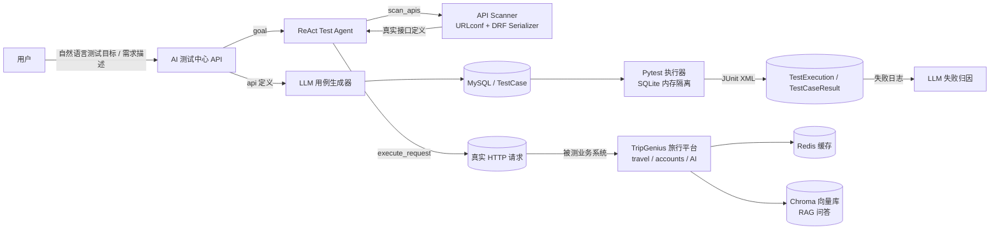

# TripGenius AI Test Agent

> 基于 **ReAct + Tool Calling** 的智能接口测试 Agent 系统：以 Django + DRF 智能旅行平台为被测业务系统，由 LLM 自主完成「任务规划 → 工具调用 → 用例生成 → 自动执行 → 失败归因」的闭环接口测试。

一个自带被测系统的 **LLM 测试执行平台**：不依赖人写用例，输入一句自然语言目标（如「验证旅行计划的增删改查」），测试 Agent 会自己扫描接口、构造请求、比对状态码与响应内容、生成结论并落库；同时支持按接口定义批量 AI 生成 pytest 用例并隔离执行，失败后自动进行 AI 归因。

---

## 项目亮点

- **ReAct + Tool Calling 自主测试 Agent**：LLM 在「思考 → 调用工具 → 观察结果 → 再思考」循环中自主完成任务，注册了 `scan_apis` / `execute_request` 两个函数工具，支持失败后更换参数重试，最后输出结构化 JSON 测试报告。
- **接口扫描替代幻觉**：通过递归解析 Django URLconf 与 DRF Serializer，拿到**真实**的接口路径、HTTP 方法、请求字段、鉴权要求，Agent 与用例生成都以扫描结果为约束，杜绝 LLM 凭空捏造接口。
- **LLM 自动生成测试用例**：既可按需求描述生成，也可按单个扫描到的接口定义生成（正常 / 异常参数 / 未授权三类场景），用例结构化落库并支持一键执行。
- **隔离回归执行**：AI 生成的用例即时渲染为 pytest 源码，通过独立配置（SQLite 内存库 + 内存缓存 + Celery 同步）在子进程中执行，**不触碰生产 MySQL / Redis / 向量库**；结果解析 JUnit XML 回写并统计。
- **LLM 失败归因**：对失败用例自动结合失败日志与接口响应，产出 `根因 + 修复建议 + 严重级别`，沉淀到执行结果中。
- **自带完整被测系统**：Django + DRF 旅行平台（计划/日程/行李清单 + JWT 鉴权），并集成 RAG 知识问答、Redis 缓存、Celery 异步任务与 Docker 部署，开箱即可演示全链路。

---

## 系统架构



## 核心工作链路

| 环节 | 实现 | 入口 |
| --- | --- | --- |
| Agent 自主测试 | [qa/services/test_agent.py](qa/services/test_agent.py)：`TestAgent.run()` 多轮循环 + `scan_apis` / `execute_request` 工具分发 | `POST /api/qa/agent/run/` |
| 接口扫描 | [qa/services/api_scanner.py](qa/services/api_scanner.py)：递归 URLconf + ViewSet methods + Serializer 字段 + 权限推断 | `GET /api/qa/cases/scan/` |
| AI 生成用例 | [qa/services/ai_generator.py](qa/services/ai_generator.py)：按需求 / 按接口定义生成并落库 | `POST /api/qa/cases/generate/`、`generate-from-api/` |
| 隔离执行 | [qa/services/executor.py](qa/services/executor.py)：动态生成 pytest 源码 → `django.test.Client` 执行 → JUnit 回写 | `POST /api/qa/executions/{id}/run/` |
| 失败归因 | [qa/services/failure_analyzer.py](qa/services/failure_analyzer.py)：根因 / 建议 / 严重级别 | 执行时自动触发 或 `POST /api/qa/executions/{id}/analyze/` |
| 异步任务 | [qa/tasks.py](qa/tasks.py)：`execute_test_run` / `agent_test_run`（Celery，broker 不可用时同步降级） | - |

### 数据模型（[qa/models.py](qa/models.py)）

- `TestSuite`：测试套件
- `TestCase`：用例（`manual` / `api` 两种类型，`P0~P3` 优先级，来源 `manual/ai/scan`；接口用例含 `method/endpoint/params/expected_status/expected_keywords/need_auth`）
- `TestExecution`：一次执行记录（状态、通过/失败/跳过统计、耗时、summary）
- `TestCaseResult`：单条结果（状态、日志、AI 失败分析 `analysis`）

---

## 被测业务系统（TripGenius 旅行平台）

提供 REST API 作为 Agent 与用例的测试对象，全部接口默认需 JWT 鉴权（`Bearer`），注册/登录除外：

| 模块 | 接口（前缀 `/api/`） |
| --- | --- |
| 账户鉴权 `accounts` | `accounts/register/`、`accounts/login/`、`accounts/login/refresh/`、`accounts/logout/`、`accounts/profile/` |
| 旅行计划 `travel` | `travel/list/`、`travel/create/`、`travel/{id}/`、`travel/{id}/update/`、`travel/{id}/delete/`、`travel/{id}/schedule/add/`、`travel/{id}/packing/add/` |
| AI 能力 `AI` | `ai/ask/`（RAG 问答）、`ai/translate/`（Redis 缓存翻译）、`ai/recommend/`（RAG + LLM 生成行程方案） |
| AI 测试中心 `qa` | `qa/suites/`、`qa/cases/`、`qa/executions/`、`qa/agent/run/` |

除 REST API 外，还提供 `index / ai / travel / qa` 四个服务端模板页面，可直接在浏览器体验 RAG 问答、旅行计划管理与测试中心看板。

---

## 技术栈

- **后端**：Django 4.2 · DRF 3.16 · SimpleJWT · Celery 5.6 · gunicorn
- **AI/RAG**：openai SDK（OpenAI 兼容，可切 DeepSeek 等）· LangChain · ChromaDB · SentenceTransformer（本地 Embedding `bge-small-zh-v1.5`）
- **数据/中间件**：MySQL 8 · Redis 7 · docker / docker-compose · Nginx
- **测试**：pytest · pytest-django · pytest-cov · factory-boy · Faker · ruff

---

## 目录结构

```
tripgenius-ai-test-agent/
├── tripgenius/            # 工程配置（settings / urls / celery / test_settings）
├── accounts/              # 用户与 JWT 鉴权（被测系统）
├── travel/                # 旅行计划业务（被测系统：CRUD + Redis 缓存）
├── AI/                    # LLM 服务层（RAG 问答 / 翻译 / 方案推荐）
│   ├── rag_service.py     # Chroma 向量库检索 + LLM 回答
│   ├── embedding.py       # 本地 bge-small-zh-v1.5 向量化
│   └── openai_service.py  # OpenAI 兼容 Chat 封装
├── knowledge/             # 知识库数据源 + build_vector 构建命令
├── qa/                    # ★ AI 测试中心
│   ├── models.py          # TestSuite / TestCase / TestExecution / TestCaseResult
│   ├── services/
│   │   ├── test_agent.py        # ReAct + Tool Calling Agent
│   │   ├── api_scanner.py       # 接口扫描（URLconf + Serializer）
│   │   ├── ai_generator.py      # LLM 用例生成
│   │   ├── executor.py          # pytest 隔离执行
│   │   └── failure_analyzer.py  # LLM 失败归因
│   ├── tasks.py           # Celery 异步任务
│   └── management/commands/seed_qa.py  # 演示套件（6 条核心流程用例）
├── test/                  # 工程自测（pytest，SQLite 内存隔离）
├── templates/ static/     # 浏览器演示页面
├── deploy/                # nginx / supervisor 配置
├── Dockerfile  docker-compose.yml  pytest.ini  requirements.txt
└── .env.example           # 环境变量模板
```

---

## 快速开始

### 1. 环境准备

需要 Python 3.11 与 MySQL、Redis（本地安装或用 `docker compose up -d mysql redis` 启动）。随后：

```bash
python -m venv .venv
# Windows: .venv\Scripts\activate ; Linux/macOS: source .venv/bin/activate
pip install -r requirements.txt
cp .env.example .env        # 按注释填写 DB / Redis / LLM Key
```

### 2. 初始化并启动

```bash
python manage.py migrate                # 建表
python manage.py seed_qa                # （可选）预置演示套件 + 6 条核心流程用例
python manage.py build_vector           # （可选）构建 RAG 向量库
python manage.py runserver              # http://127.0.0.1:8000
```

> Agent 做真实 HTTP 验证时，会使用 `.env` 中 `AGENT_USERNAME/AGENT_PASSWORD`（默认 `demo_admin/admin12345`）登录换取 JWT——请将该账号改为你注册的真实账号，或先用注册接口创建一个。

### 3. Docker 部署（web + worker + nginx + mysql + redis）

```bash
docker compose up -d --build
# nginx: http://localhost  →  web(gunicorn) 反向代理
# Celery worker 独立容器消费异步测试任务
```

### 4. 运行工程自测（隔离执行，不依赖 MySQL/Redis/LLM）

```bash
pytest                      # 读取 pytest.ini，自动切到 tripgenius.test_settings
pytest --cov                # 覆盖率（见 .coveragerc）
```

---

## 使用示例

以注册接口演示完整闭环：**扫描 → 生成用例 → 执行 → 归因**。

```bash
# 1) 注册并登录（JWT）
curl -s -X POST http://127.0.0.1:8000/api/accounts/register/ \
  -H "Content-Type: application/json" \
  -d '{"username":"demo","password":"demo_pass_123","email":"demo@x.com"}'

TOKEN=$(curl -s -X POST http://127.0.0.1:8000/api/accounts/login/ \
  -H "Content-Type: application/json" \
  -d '{"username":"demo","password":"demo_pass_123"}' | python -c "import sys,json;print(json.load(sys.stdin)['access'])")
AUTH="Authorization: Bearer $TOKEN"

# 2) 扫描真实接口（来自 URLconf + Serializer，非 LLM 幻觉）
curl -s http://127.0.0.1:8000/api/qa/cases/scan/ -H "$AUTH"

# 3) 让 AI 测试 Agent 自主完成一次接口回归
curl -s -X POST http://127.0.0.1:8000/api/qa/agent/run/ -H "$AUTH" \
  -H "Content-Type: application/json" \
  -d '{"goal":"验证注册接口：正确注册返回201；缺少密码返回400"}'

# 4) 或按某个接口定义 AI 生成用例后批量执行
curl -s -X POST http://127.0.0.1:8000/api/qa/cases/generate-from-api/ -H "$AUTH" \
  -H "Content-Type: application/json" \
  -d '{"api":{"name":"注册","path":"/api/accounts/register/","methods":["POST"],"fields":["username","password","email"],"need_auth":false}}'
# 创建一次执行：POST /api/qa/executions/  →  触发：POST /api/qa/executions/{id}/run/
```

RAG 知识问答（浏览器打开 `http://127.0.0.1:8000/ai` 体验，或调用接口）：

```bash
curl -s -X POST http://127.0.0.1:8000/api/ai/ask/ -H "$AUTH" \
  -H "Content-Type: application/json" -d '{"question":"去东京玩需要注意什么？"}'
```

---

## 关键设计：隔离测试，保护生产数据

AI 生成的用例在执行前被渲染为独立 pytest 文件，并以 **`tripgenius.test_settings`**（[tripgenius/test_settings.py](tripgenius/test_settings.py)）运行：

- 数据库切到 SQLite `:memory:`，缓存切到 locmem，Celery 切到同步 eager；
- Chroma 向量库指向系统临时目录，日志关闭写盘；
- 用例经 `django.test.Client` 在测试事务中执行，结束后临时文件即删。

因此批量回归**永远不会污染**生产 MySQL / Redis / 向量库；而 Agent 的 `execute_request` 工具走真实 HTTP，用于验证线上行为（两种验证链路职责清晰，见 [qa/services/executor.py](qa/services/executor.py)）。

---

## 说明与边界

- LLM 相关能力均通过 `OPENAI_BASE_URL` 指向任意 OpenAI 兼容服务，示例 `.env` 使用 DeepSeek，无需固定供应商。
- 接口扫描基于本工程 URLconf 动态生成；若被测系统是独立服务，可在 `qa/services/api_scanner.py` 中扩展为读取其路由元数据。
- `requirements.txt` 中 `sentence-transformers` 首次运行会自动下载 embedding 模型（约 100MB），离线环境可替换 `AI/embedding.py` 的向量化实现。
