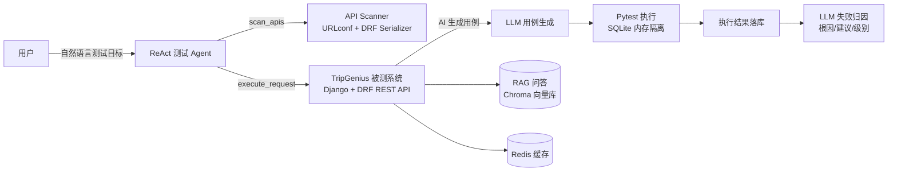

# 基于 ReAct 的智能测试 Agent 平台

> 基于 **Django** 开发智能旅行平台作为被测业务系统，构建面向 **REST API** 的智能测试 Agent，实现测试任务的**自主规划、用例生成、自动执行与结果分析**。

## 项目介绍

本系统由「被测业务系统 + 智能测试 Agent」两部分组成：被测侧是基于 Django + DRF 的智能旅行平台（旅行计划管理、RAG 问答、翻译、行程推荐等 REST API）；测试侧是基于 **ReAct + Tool Calling** 架构的 LLM 测试 Agent 与 AI 测试中心，输入一句自然语言目标即可自主完成接口扫描、用例生成、Pytest 执行、结果落库与失败归因的闭环测试。

## 主要工作与核心亮点

1. **ReAct + Tool Calling 测试 Agent**：采用 ReAct + Tool Calling 架构实现测试 Agent，自主完成任务规划、工具调用（`scan_apis` / `execute_request`）、执行反馈与失败重试，最后输出结构化测试结论；
2. **接口解析与 LLM 用例生成**：通过解析 Django URLconf 与 DRF Serializer 获取真实接口路径、参数与鉴权要求，交由 LLM 自动生成测试用例，并调用 Pytest 完成隔离执行、结果自动回写；
3. **LLM 失败归因与异常定位**：结合失败日志与接口响应，利用 LLM 自动进行失败归因与异常定位，输出根因、修复建议与严重级别；
4. **完整被测业务系统**：使用 Django + DRF 开发智能旅行被测系统（JWT 鉴权、旅行计划 CRUD、RAG 问答），集成 Redis 缓存与 Celery 异步任务，并通过 Docker 完成容器化部署。

## 系统架构



## 被测系统业务能力（REST API）

| 模块 | 能力 |
| --- | --- |
| 账户鉴权 | 注册 / JWT 登录 / 刷新 / 登出 / 个人资料 |
| 旅行计划 | 计划 CRUD、每日行程添加、行李清单管理 |
| AI 问答 | RAG 知识问答（`/api/ai/ask/`）、智能翻译（Redis 缓存）、行程方案推荐 |
| AI 测试中心 | 测试套件/用例/执行管理、接口扫描、用例生成、Agent 运行入口 |

## 技术栈

| 类别 | 技术 |
| --- | --- |
| 被测系统 | Django 4.2 · DRF 3.16 · SimpleJWT（JWT 鉴权） |
| 智能测试 | ReAct + Tool Calling · LLM 用例生成 · Pytest 隔离执行 · LLM 失败归因 |
| AI / RAG | OpenAI 兼容大模型接口 · LangChain · ChromaDB · 本地 Embedding |
| 中间件 | MySQL · Redis（缓存 / Session / Celery broker）· Celery 异步任务 |
| 部署 | Docker / docker-compose · gunicorn · Nginx |

## 目录结构

```
├── tripgenius/            # 工程配置（settings / urls / celery / test_settings）
├── accounts/              # 用户注册与 JWT 鉴权
├── travel/                # 旅行计划业务（CRUD + Redis 缓存）
├── AI/                    # LLM 服务层（RAG 问答 / 翻译 / 行程推荐）
├── knowledge/             # 知识库语料与向量库构建
├── qa/                    # AI 测试中心（Agent / 接口扫描 / 用例生成 / 执行 / 归因）
│   └── services/
│       ├── test_agent.py        # ReAct + Tool Calling Agent
│       ├── api_scanner.py       # 接口参数与鉴权扫描
│       ├── ai_generator.py      # LLM 用例生成
│       ├── executor.py          # Pytest 隔离执行
│       └── failure_analyzer.py  # LLM 失败归因
├── test/                  # 工程自测用例（SQLite 内存隔离）
├── templates/ static/     # 浏览器端演示页面
├── deploy/                # Nginx / supervisor 部署配置
├── Dockerfile  docker-compose.yml  pytest.ini  requirements.txt
└── .env.example           # 环境变量配置模板
```

## 快速开始

```bash
pip install -r requirements.txt
cp .env.example .env                # 填写 DB / Redis / LLM Key
python manage.py migrate
python manage.py runserver          # 启动被测系统
pytest                              # 运行工程自测（隔离环境，无需外部依赖）

# Docker 一键部署（web + worker + nginx + mysql + redis）
docker compose up -d --build
```
